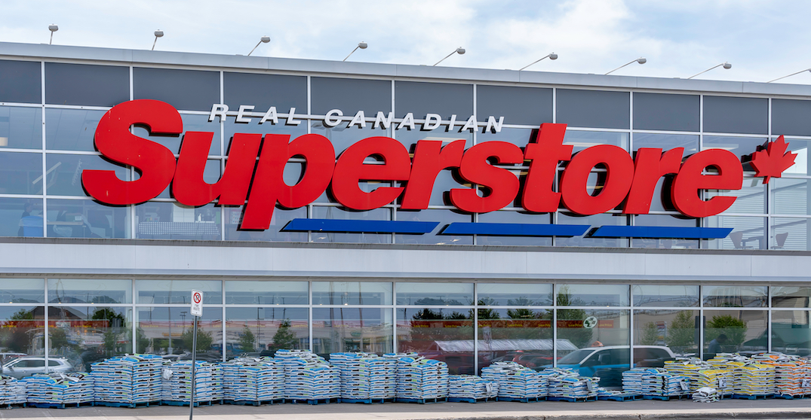

### [Project 3: Canadian superstore sales analysis](https://github.com/Aellawah/Canadian-superstore-sales-analysis/blob/main/Canadian%20Superstore%20sales.ipynb)

In this notebook we will explore Data of a canadian superstore that exists in different places around the world and try to gain some insights about the business and the most selling products.

Some of our conclusions was:

* The sales trend over the years is increasing along the from 2011 to 2014
* Customers prefer to use Standard class & Second class as shipping modes
* The most profitable category is Technology & the most profitable sub category is Copiers
* People tend to buy more by the end of the year since the statistics shows that people buy more in the 4th quarter of each year
* The store can make more money when sending products to far areas which requires high cost of shipping 
* Best market per sales is APAC which is Asia pcific markets
